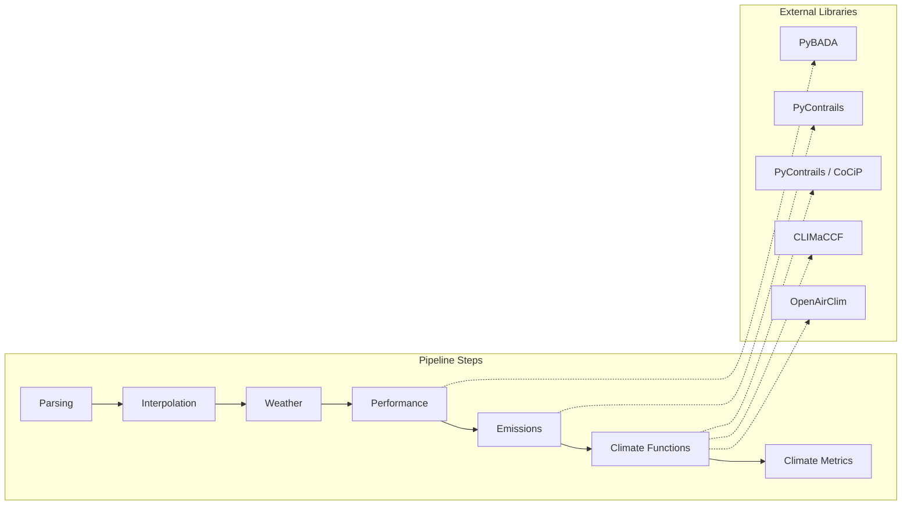

# Architecture

## Overview

PyNeats implements the MRV (Monitoring, Reporting, and Verification) computation pipeline for non-CO₂ aviation climate impacts. The architecture follows a **modular pipeline** pattern where each step is an independent, testable unit.



## Repository Layout

```
src/pyneats/
├── core/                       # Shared types, protocols, and step framework
│   ├── steps.py                # Step / BaseStep / VectorizedStep protocols
│   ├── steps_registry.py       # register() / build() — step factory
│   ├── views.py                # FlightView base class
│   ├── fleet_utils.py          # flights_to_fleet / fleet_to_flights
│   ├── neats_fuel.py           # NEATSFuel (SAF blend properties)
│   ├── physics.py              # Physical constants
│   └── compute_parameters.py   # Default parameter computation
├── runners/                    # Orchestration of pipeline steps
│   ├── runner.py               # Runner ABC
│   ├── flight.py               # FlightRunner — single-flight pipeline
│   ├── fleet.py                # FleetRunner — fleet-level parallel execution
│   ├── large_emitter.py        # Method C runners (CoCiP + aCCFs)
│   └── small_emitter.py        # Method D runners (OpenAirClim)
├── steps/                      # Pipeline stages
│   ├── parsing/                # Trajectory parsing (NEATS JSON, OpenSky)
│   ├── interpolation/          # Trajectory resampling (BADA, PyContrails)
│   ├── weather/                # Meteorological data (DWD ICON, ERA5)
│   ├── performance/            # Aircraft performance (BADA 3/4)
│   ├── emissions/              # Fuel burn & emission indices (DLR, PyContrails, EUROCONTROL)
│   ├── climate_functions/      # Climate forcing (CoCiP, aCCFs, OpenAirClim)
│   └── climate_metrics/        # GWP, CO₂-equivalent, reporting
└── resources/                  # Bundled data files
```

## Key Abstractions

### Step Protocol

Every pipeline stage implements the `Step` protocol:

```python
class Step(Protocol[InFlight, OutFlight]):
    def __call__(self, flight: InFlight) -> OutFlight: ...
```

Concrete steps extend `BaseStep[In, Out, Params]`, which manages parameter injection and provides a uniform interface for the registry.

### Step Registry

Steps are registered by protocol type and looked up by name at runtime:

```python
from pyneats.core.steps_registry import register, build

@register(TrajectoryParser, "neats")
class NeatsTrajectoryParser(BaseStep[...]):
    ...

parser = build(TrajectoryParser, "neats", model_type="CTFM")
```

### Flight Views

Flight data flows through the pipeline as progressively enriched views:

```
Flight4D → FlightWithWeather → FlightWithPerformance → FlightWithEmissions → FlightWithClimateImpact
```

Each view adds validated columns (e.g., `fuel_flow`, `nox_ei`, `rf_contrails`) while preserving upstream data.

### Runners

Runners orchestrate the full pipeline:

| Runner | Scope | Method |
|---|---|---|
| `FlightRunnerLargeEmitter` | Single flight | C (CoCiP + aCCFs) |
| `FleetRunnerLargeEmitter` | Fleet (parallel) | C |
| `FlightRunnerSmallEmitter` | Single flight | D (OpenAirClim) |
| `FleetRunnerSmallEmitter` | Fleet (parallel) | D |

Fleet runners use `joblib` for parallelisation with fault tolerance per flight.

## Design Decisions

| Decision | Rationale |
|---|---|
| Protocol-based steps | Swap implementations without changing runners |
| Step registry | Runtime lookup enables configuration-driven pipelines |
| Progressive flight views | Type safety — each step declares its required inputs |
| `src/` layout | PEP 621, no import conflicts |
| No new numerical kernels | Relies on PyContrails, PyBADA, CLIMaCCF for computation |
