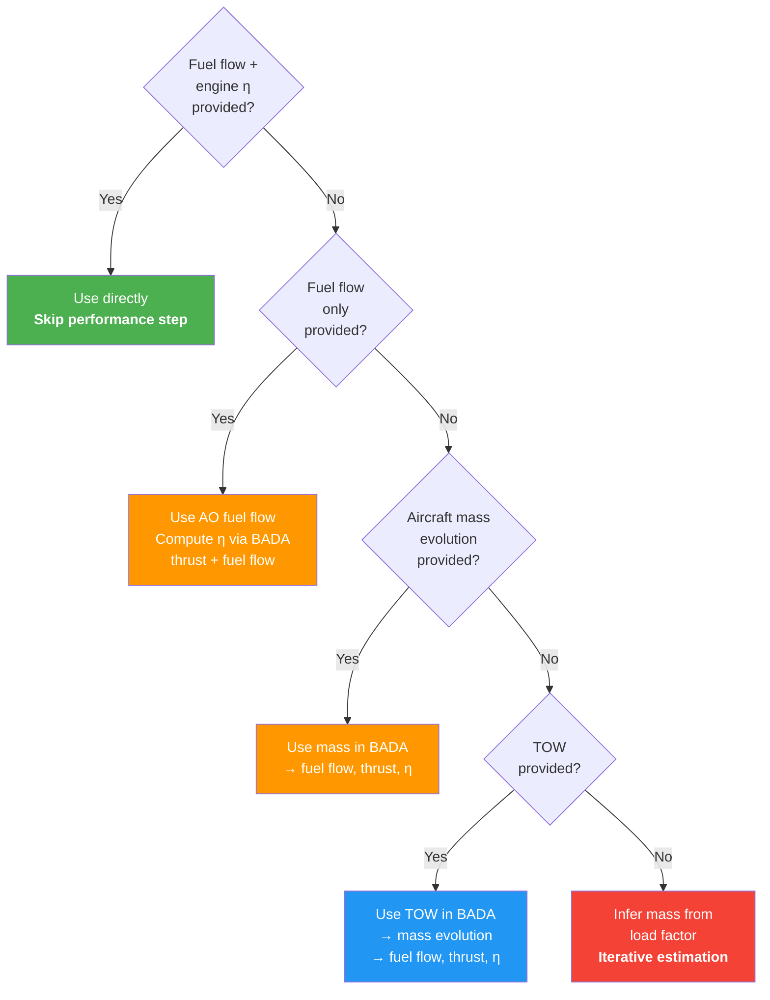

# Input Prioritization

PyNeats follows a **primary-data-first** principle: use aircraft operator (AO) data when available; otherwise, apply conservative secondary defaults.

This page describes the decision logic for determining which performance and fuel inputs are used at each trajectory point.

---

## Data Sources

| Data | Primary (AO-provided) | Secondary (modelled) |
|---|---|---|
| Trajectory | OFP, QAR, ADS-B | FTFM/RTFM, CTFM |
| Fuel flow | Recorded fuel flow | BADA estimate |
| Engine efficiency | Recorded η | BADA thrust / fuel flow |
| Aircraft mass | Mass evolution | BADA iterative estimate |
| Take-off weight | AO-declared TOW | OEW + load_factor × (MTOW − OEW) |
| Fuel properties | AO-declared (H/C, q_fuel) | JET-A defaults |
| Engine UID | AO-declared | MRR conservative value |

---

## Performance Input Decision Tree

!!! note "Case 2 — Fuel flow without engine efficiency"
    Even when the AO provides fuel flow, BADA fuel flow and thrust must still be computed at each trajectory point to derive engine efficiency correctly. The AO fuel flow is used for downstream emission calculations.

---

## Mass Estimation (Case 5)

When neither aircraft mass nor TOW is available, PyNeats applies an **iterative** procedure using the load factor (AO-provided or conservative default of 1):

**Step 1 — Initial estimate:**

$$
m_{\text{init}} = OEW + \text{load\_factor} \times (MTOW - OEW)
$$

**Step 2 — Compute fuel flow** and fuel burn at each trajectory point using BADA.

**Step 3 — Estimate fuel reserve** (≈ 3 % of trip fuel).

**Step 4 — Update TOW:**

$$
TOW = \min(MTOW,\; OEW + \text{load\_factor} \times MPL + \text{consumed\_fuel} + \text{reserve})
$$

Reduce aircraft mass along the trajectory according to fuel burnt at each point.

**Step 5 — Iterate** steps 2–4 until convergence. In PyNeats, **two iterations** are used to balance accuracy and computational cost.

!!! info
    BADA 3 does not provide MPL (Maximum Payload). In that case, MPL = MTOW − OEW.

---

## BADA Type Mapping

The correspondence between ICAO aircraft types, aircraft versions, engine identifiers and BADA types follows a multi-level fallback strategy:

1. **BADA 4** match (preferred — higher fidelity)
2. **BADA 3** fallback if no BADA 4 type exists
3. **Fleet statistics** used as frequency-based proxies when no direct mapping is possible

The engine UID for emission computations defaults to the **MRR conservative value** if not provided as primary data.

---

## Impact on Accuracy

The granularity of AO-provided data significantly affects output accuracy:

| Input level | Performance accuracy | Notes |
|---|---|---|
| Full primary (mass + fuel + η) | ★★★★★ | Best — no modelling needed |
| Fuel flow only | ★★★★☆ | η derived from BADA |
| Mass evolution | ★★★☆☆ | Full BADA performance chain |
| TOW only | ★★☆☆☆ | Mass evolution estimated |
| Load factor only | ★☆☆☆☆ | Fully modelled — conservative |
