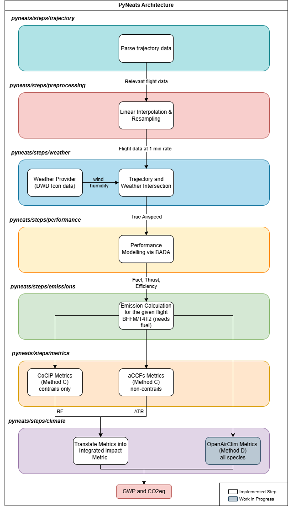
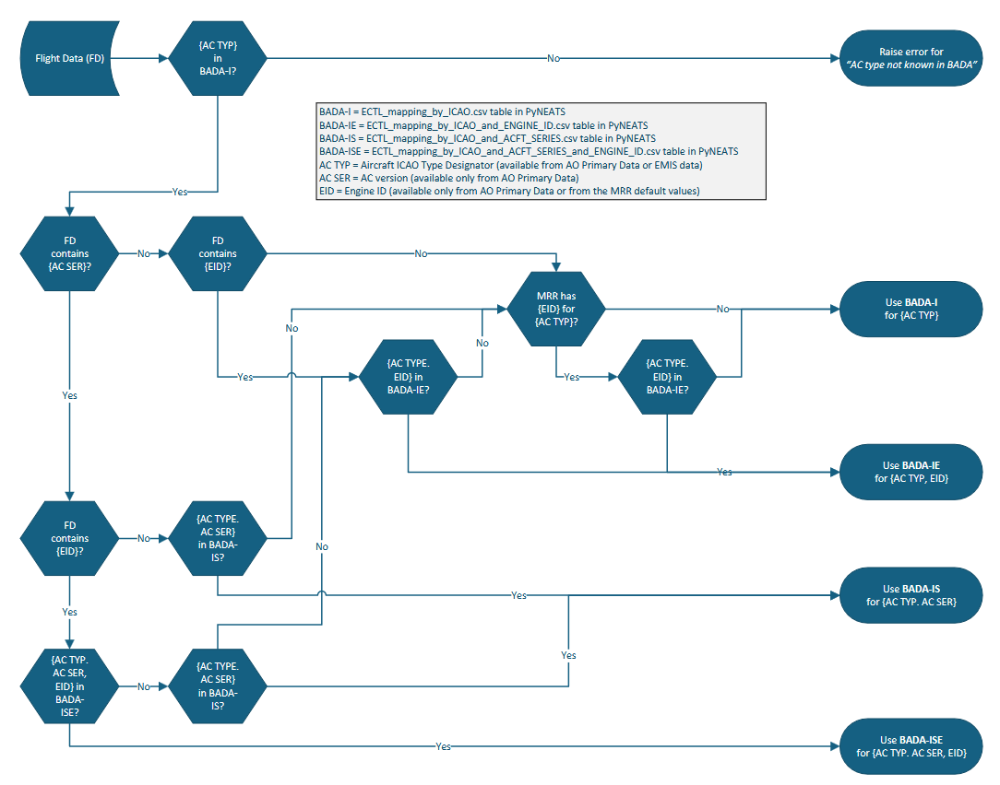

# General Presentation of PyNeats

PyNeats implements the computation pipeline defined in the *Reference set of technical specifications for the MRV*. This page describes the modules used to fulfil these requirements and documents the practical implementation choices made where the requirement document did not provide specific guidance.

!!! info "Terminology"

    Unfamiliar with AGWP, aCCF, CoCiP, SAC, FTFM/CTFM or similar terms? See the
    [Glossary](../glossary.md) (project-wide) and the [Abbreviations](#abbreviations)
    table at the bottom of this page (spec-specific).

---

## Architecture Overview

A **modular architecture** is used: functionalities are organised into isolated Python packages, each dedicated to a single and specific task. This design also enables easy comparison of, or switching to, alternative implementations in the future — e.g. different trajectory interpolators; reanalysis weather data instead of Numerical Weather Prediction (NWP); different aircraft performance models such as BADA or Poll–Schumann; emissions via DLR, PyContrails, or EUROCONTROL.

From a computational standpoint, PyNeats relies on external Python libraries to compute per-flight CO₂ equivalents (including non-CO₂ effects):

- **pyBADA** — aircraft performance computation
- **pyContrails** — CoCiP (contrails, Method C) and the pycontrails aCCF wrapper
- **aCCFs (non-CO₂ species other than contrails, Method C)** — two swappable implementations selectable via the step registry:
    - **`ACCFModel`** — delegates to the **CLIMaCCF** Python package (reference implementation from Yin/Dietmüller et al.)
    - **`LocalACCFModel`** — a local in-tree reimplementation of the aCCF v1.0A regressions, provided for computational efficiency and to remove the CLIMaCCF runtime dependency. Emulates CLIMaCCF numerically and is validated against it.
- **OpenAirClim** — Method D (small emitters)

!!! info "aCCF terminology"

    The terms **aCCF**, **CLIMaCCF** and **climaccf** are not interchangeable:

    - **aCCF** — *algorithmic Climate Change Function*: a family of regression formulas (scientific concept).
    - **CLIMaCCF** — the original reference library implementing aCCFs (Yin, Dietmüller et al.).
    - **climaccf** — the Python package name on PyPI that packages CLIMaCCF.
    - **ACCFModel** / **LocalACCFModel** — PyNeats step classes; the first wraps `climaccf`, the second is a local reimplementation.

All versions of each external library are documented in PyNeats and in the [NEATS User Group](https://eurocontrol.sharepoint.com/sites/coll-NEATSUserGroup) SharePoint.

Because of its modular design, PyNeats does not always use the highest-level abstractions of its upstream libraries. Nevertheless, it consistently builds on their established numerical utilities (primarily from PyContrails). **PyNeats introduces no new low-level numerical kernels.**

---

## 1. Modules Description

### 1.1 Trajectory Parsing

Retrieves the 4D flight trajectory and flight-level information from primary or secondary sources (e.g. **OFP, QAR, or FTFM/RTFM/CTFM** trajectories).

### 1.2 Interpolation / Resampling

Reconstructs the 4D trajectory to meet the **60-second sampling** requirement used by the CoCiP model for contrail-impact modelling.

### 1.3 Weather

Retrieves atmospheric data from **DWD's ICON NWP model** and provides:

- Wind fields for the performance module.
- All atmospheric variables required by the climate-effect models.

### 1.4 Performance (currently using BADA)

- Computes **fuel flow** and **aircraft mass** at each point along the trajectory when not provided by the AO in the primary data.
- Derives **thrust** and **engine efficiency** needed by CoCiP when not provided in the primary data.

### 1.5 Emissions

- Computes **emission indices and numbers** (vPM and nvPM).
- Supports relevant emissions models (**BFFM2**, **T4/T2**, …).
- Accounts for fuel properties.

### 1.6 Climate Effect Models

Uses trajectory, emissions, performance and weather data to compute per-flight climate effects of CO₂ and non-CO₂:

- **CoCiP** — contrail-induced cirrus cloudiness (Method C).
- **aCCFs** — other non-CO₂ species (Method C), including NOₓ and H₂O.
- **AirClim** — all non-CO₂ effects, for use **only by small emitters** (Method D).

### 1.7 Climate Metrics

Converts outputs of the climate-effect models into the requested non-CO₂ aviation-effects metrics (e.g. **GWP** and **CO₂-equivalent**) using the appropriate conversion factors.

---

## 2. Modules Dependencies

The following graph illustrates the dependency between the input(s) and output(s) of the different modules. The computational logic is **almost perfectly sequential** and implemented as such in PyNeats.

{ width="100%" }

*Figure 1 — Modules Dependencies*

---

## 3. Design Choices

This section details, for each module, the practical implementation / design choices that have been made. Choices made **outside the requirement document** or outside the nominal use of the standard libraries (PyContrails in particular) are highlighted *in italics*. Most of these choices have been discussed and coordinated with the authors of the requirement document from DLR.

### 3.1 Trajectories

Two trajectory types are used as **secondary data** when the AO does not provide the trajectory for a flight: EUROCONTROL's **FTFM/RTFM** and **CTFM**.

#### FTFM / RTFM (4D)

- The trajectory is produced by applying a 4D trajectory predictor (BADA-based) to the trajectory defined in the flight plan submitted to EUROCONTROL (**FTFM**), or to its regulated version (**RTFM** — FTFM translated in time by the delay resulting from the regulation).
- FTFM/RTFM are designed primarily for **capacity management**, so the data are **not optimised for performance modelling**.
- Sampling is relatively coarse (≈ 1 point per 5 minutes on average), which can introduce issues when applying interpolation and performance models.

#### CTFM (4D)

- Obtained by reconciling the original FTFM/RTFM with **post-flight surveillance data** (ADS-B, radar), applying adjustments when predefined difference thresholds are exceeded.
- The result is an updated and possibly enriched trajectory — typically closer to reality than the initial FTFM/RTFM, but **not as accurate as ADS-B or QAR**.
- Sampling is denser than FTFM/RTFM but still relatively coarse, with similar caveats for interpolation and performance modelling.

### 3.2 Preprocessing / Interpolation / Reconstruction

The interpolation module converts the input trajectory (primary or secondary) to the **60-second** sampling cadence required by the CoCiP climate-function module.

*PyNeats currently uses straightforward linear interpolation via PyContrails' `resample_and_fill` method. For secondary data, the coarse native sampling can yield segments that are not fully realistic and may stray outside the flight envelope after interpolation. To obtain more realistic trajectories, smoothing is applied to ground speed using the **Savitzky–Golay filter** from PyContrails, reducing the number of segments that fall outside the flight envelope.*

For optional primary variables along the trajectory (e.g. true airspeed, aircraft mass, fuel flow, or engine efficiency), **linear interpolation** is applied to align their values with the trajectory timestamps. Missing data points are filled using the same interpolation method.

### 3.3 Weather

#### 3.3.1 Weather Provider — DWD ICON mapping

DWD ICON variables covering the **550–140 hPa** range (FL160–FL460) **at an interval of 10 FL** are mapped into PyContrails objects according to the following dictionaries.

**`required_map`** (in CoCiP sense):

| DWD variable | PyContrails object |
|---|---|
| `u` | `EastwardWind` |
| `v` | `NorthwardWind` |
| `omega` | `VerticalVelocity` |
| `temp` | `AirTemperature` |
| `qv` | `SpecificHumidity` |
| `qi` | `MassFractionOfCloudIceInAir` |

**`optional_map`** (in CoCiP sense):

| DWD variable | PyContrails object |
|---|---|
| `geopot` | `Geopotential` |
| `clc` | `CloudAreaFractionInAtmosphereLayer` |
| `rhi` | `RelativeHumidity` |
| `pv` | `PotentialVorticity` |

**`rad_map`**:

| DWD variable | PyContrails object |
|---|---|
| `tsr` | `TOANetDownwardShortwaveFlux` |
| `olr` | `TOAOutgoingLongwaveFlux` |
| `sdr` | `SurfaceSolarDownwardRadiation` |

#### 3.3.2 Trajectory and Weather Intersection

Performance models such as BADA require **true airspeed (TAS)** to estimate aircraft performance over most of the flight. TAS can be computed from ambient wind (direction and magnitude), ground speed, heading, and track. To support this, DWD was asked to supply an **additional wind-field dataset** for **840–570 hPa (FL050–FL150)**, complementing the main file (550–140 hPa, ≈ FL160–FL460) that already provides atmospheric variables at higher altitudes.

- Both wind datasets are **concatenated**, and below FL050 the wind is set to **zero**, simplifying TAS derivation in the lower atmosphere.
- **Temperature**: interpolated on the main file (550–140 hPa) to provide BADA with the required temperature-based correction relative to the standard atmosphere. Extrapolation for lower altitudes is performed in the performance module (see §3.4).
- **Specific humidity**: interpolated on the main file (550–140 hPa) to supply the emission model for further use in CoCiP.

To compute the intersection more efficiently (using `intersect_met`), the weather data is first sub-sampled using `downselect_met` in PyContrails.

### 3.4 Performance Model

The emissions and climate modules require the following aircraft-performance values at each point along the trajectory, in addition to the timestamped position:

- **Fuel flow**
- **Engine efficiency**

The performance model is used to estimate these values when they are not available at a point along the trajectory.

**BADA** is the current chosen model for performance computation in PyNeats, in its open-source version from EUROCONTROL (**pyBADA**). BADA requires, at a given point of the trajectory:

- **True Airspeed (TAS)**
- **Aircraft mass**

#### Basic Parameterisation

- If TAS is not provided by the AO, wind fields **above 840 hPa (FL050)** are used to compute it; below that pressure level TAS is set to 0.
- The International Standard Atmosphere is corrected with actual air above 550 hPa, backfilling and forward-filling the correction for lower altitudes.
- BADA flight phases are determined from **vertical speed** using simple decision thresholds.

#### Input Decision Logic

The following rules are applied **sequentially** to determine how the primary data provided by the AO is used:

1. **Fuel flow and engine efficiency provided at each point:** no additional computation; the performance step is **skipped** and provided values are used directly downstream.
2. **Fuel flow only provided at each point:** AO fuel flow (kg/s) is used downstream. However, **engine efficiency requires thrust AND fuel flow** from a consistent source. To avoid mixing AO fuel flow with BADA-estimated thrust (which would be inconsistent), BADA fuel flow must **still be computed** at each trajectory point so that **engine efficiency = f(BADA thrust, BADA fuel flow)**.
3. **Aircraft mass evolution provided:** used directly in BADA to compute fuel flow, thrust, and engine efficiency.
4. **Only take-off weight (TOW) provided:** TOW is used in the performance model to estimate mass evolution along the trajectory, and then fuel flow, thrust, and engine efficiency are computed with BADA.
5. **Neither mass nor TOW provided:** the load factor is used (AO-provided or conservative default of 1). The following approach (similar to PyContrails) is applied:

    1. **Initial estimate** (constant along the trajectory):

        $$\text{Aircraft mass} = OEW + \text{load\_factor} \times (MTOW - OEW)$$

        where OEW (operative empty weight) and MTOW (maximum take-off mass) are obtained from BADA.

    2. **First performance calculation:** compute fuel flow and fuel burn at each trajectory point from this mass.

    3. **Fuel-reserve estimation:** the required reserve is approximated at **3 % of trip fuel**.

    4. **Updated TOW:**

        $$TOW = \min \bigl(MTOW,\; OEW + \text{load\_factor} \times MPL + \text{consumed\_fuel} + \text{reserve}\bigr)$$

        where MPL is the maximum payload and `consumed_fuel` is the total fuel burn estimated in step 2. Aircraft mass along the trajectory is then reduced according to fuel burnt.

        !!! note "BADA 3 and MPL"
            BADA 3 does not provide MPL. If BADA 3 is used, $\text{MPL} = MTOW - OEW$.

    5. **Iteration:** steps 2–4 are repeated until convergence (fixed number of iterations, or relative-tolerance stopping criterion). In PyNeats, **steps 2–4 are performed twice** to reduce computational effort.

See [Input Prioritization](input-prioritization.md) for the full decision flowchart.

#### Additional Parameters

- **Fuel calorific value (`q_fuel`):** if provided by the AO, applies a **linear correction** to the BADA fuel flow rate. If not provided, no correction is applied.
- **ICAO ↔ BADA mapping:** the correspondence between ICAO aircraft types, aircraft versions, engine identifiers and BADA types (**BADA 4 in priority**, then **BADA 3**) is achieved following the decision tree in Figure 2.

{ width="100%" }

*Figure 2 — ICAO-BADA Correspondence*

### 3.5 Emissions Model

PyNeats uses the emission model within **PyContrails** that implements the **BFFM2** and **T4/T2** models.

To account for fuel properties provided by AOs, a **custom `NEATSFuel` class** has been designed specifically for NEATS. This class is passed to the initial PyContrails `Flight` object at the start of the computation and defines the following properties.

- The `NEATSFuel` class **inherits from `SAFBlend`** in CoCiP:
    - All fuel properties defined in `SAFBlend` are initially set identically in `NEATSFuel`.
    - If the AO provides a value for the **hydrogen content** fuel property, it overrides the initial `hydrogen_content` value.
    - If the AO has not provided hydrogen content but has provided the **hydrogen-to-carbon molecular mass ratio ($r$)**, `hydrogen_content` is overridden by:

        $$\text{Hydrogen content} = \frac{r \cdot 1.008}{12.011 + r \cdot 1.008}$$

    - If the AO provides the **calorific value**, it overrides the `q_fuel` conservative default of **42 800 000 J/kg**.
    - If **neither** hydrogen content **nor** hydrogen-to-carbon ratio is provided, the hydrogen content defaults to the conservative **13.79 %**.
- The water emission index **`ei_h2o`** (initial default 1.23 in PyContrails/CoCiP) is **adjusted linearly** based on the hydrogen content value, in line with what is done in `SAFBlend`.
- The **nvPM** is reduced using the `black_carbon` class from PyContrails — as done in `SAFBlend` — taking the hydrogen content as parameter (currently only available for SAF in PyContrails).
- The **aromatic content, sulphur, and naphthalene** fuel properties, which an AO can provide, are **not used so far** in any calculation of the Emissions module.
- If **no engine** is provided by the AO, emission computations are performed using the **conservative engine** provided by the default table in the **MRR**.

### 3.6 Climate Functions

The parameterisation of the climate functions is specified precisely in the requirement document. Note however (as clarified by the consortium) that:

- The alteration of the calorific value (`q_fuel`) will have an impact on the **SAC** (Schmidt-Appleman Criterion) computation in CoCiP.
- It has been finally chosen **not to apply any humidity correction** to the ICON NWP data.
- As specified in the requirement document, **aCCF version `v1.0A`** is used.

### 3.7 Climate Metrics

The CO₂-equivalent computation is based on **GWP for three horizons: 20, 50, and 100 years**. The formulas used are detailed below.

#### 3.7.1 Method C

The **EAGWP** (Efficacy-adjusted Absolute Global Warming Potential) for Contrails at the time horizon $H$ is defined as:

$$
EAGWP_{Con}(H) = \frac{EF \cdot \varepsilon_{Con}}{S_{Earth} \cdot s_{yr}} \quad [W \cdot m^{-2}]
$$

where:

- $EF$ is the total contrail energy forcing from CoCiP (sum over all segments) $[J]$
- $\varepsilon_{Con} = 0.37$ is the **efficacy for contrails**, specified in the technical requirement document
- $S_{Earth} = 5.101 \cdot 10^{14}\ [m^2]$ is the Earth's surface
- $s_{yr} = 31\,536\,000$ : seconds per year

The **AGWP for CO₂** at the time horizon $H$ is obtained using AirClim values scaled by emitted mass:

$$
AGWP_{CO2}(H) = C(H) \cdot m_{CO2} \quad [W \cdot m^{-2}]
$$

where $C(H)$ are AGWP coefficients at horizon $H$ from AirClim:

| Horizon $H$ (y) | $C(H)$ |
|---|---|
| 20  | $24.16 \cdot 10^{-15}$ |
| 50  | $47.57 \cdot 10^{-15}$ |
| 100 | $74.36 \cdot 10^{-15}$ |

and $m_{CO2}$ is the total CO₂ emitted on the flight.

The **CO₂-equivalent of contrails** is therefore defined as:

$$
CO2_{eq,Con}(H) = \frac{EF \cdot \varepsilon_{Con}}{S_{Earth} \cdot C(H) \cdot s_{yr}} \quad [kg]
$$

The **EAGWP obtained for all non-contrails species** is obtained from aCCFs (v1.0a) by applying conversion factors as defined in *Dahlmann et al. (2025)*:

$$
EAGWP_{Spec}(H) =
\frac{K_{AGWP \leftarrow RF}^{Spec}(H)}{K_{ATR \leftarrow RF}^{Spec}(H_0)}
\cdot \frac{\varepsilon_{Spec}^{2}}{RF_{Spec}^{Backward}}
\cdot ATR^{Spec}(H_0) \quad [W \cdot m^{-2}]
$$

where:

- $K_{AGWP \leftarrow RF}^{Spec}(H)$ is the conversion factor from *Dahlmann et al. (2025)* that converts RF from pulse emissions to $AGWP(H)$ (cf. below).
- $K_{ATR \leftarrow RF}^{Spec}(H)$ is the conversion factor from *Dahlmann et al. (2025)* that converts RF from pulse emissions to $ATR(H)$ (cf. below). These conversion factors **include efficacy** for ATR calculation. It is therefore necessary to multiply the ATR values from the aCCFs with the efficacy to be consistent with the conversion factors. This translates into the **efficacy being squared** in the formula.
- $ATR^{Spec}(H_0)$ is the output from the aCCF with a pulse scenario and no efficacy parameterisation.
- $RF_{Spec}^{Backward}$ is the **RF backward calculation factor** used in aCCF v1.0 and v1.0a (*Yin et al., 2023; Dietmüller et al., 2023*) that needs to be **discounted** here as it is not consistent with factors from *Dahlmann et al. (2025)*:

    | Species | $RF_{Spec}^{Backward}$ |
    |---|---|
    | H₂O | 0.52 |
    | O₃ | 0.508 |
    | CH₄ | 0.492 |

- $H_0 = 20$ is the reference horizon for pulse computation within CLIMaCCF.
- $\varepsilon_{Spec}$ are the efficacies as defined in the specification document.

The conversion factors $K_{AGWP \leftarrow RF}$ and $K_{ATR \leftarrow RF}$ (Pulse 2025 scenario, from *Dahlmann et al., 2025*) used in PyNeats are:

**$K_{AGWP \leftarrow RF}^{Spec}(H)$** — RF → AGWP conversion (per species, per horizon):

| Horizon $H$ | CH₄ | O₃ | H₂O | PMO |
|---|---|---|---|---|
| 20  | 10.6318 | 1.0192 | 1.0192 | 10.6318 |
| 50  | 13.0968 | 1.0192 | 1.0192 | 13.0968 |
| 100 | 13.3563 | 1.0192 | 1.0192 | 13.3560 |

**$K_{ATR \leftarrow RF}^{Spec}(H)$** — RF → ATR conversion (includes efficacy):

| Horizon $H$ | CH₄ | O₃ | H₂O | PMO |
|---|---|---|---|---|
| 20  | 0.2838 | 0.0337 | 0.0320 | 0.2690 |
| 50  | 0.1898 | 0.0154 | 0.0146 | 0.1800 |
| 100 | 0.1059 | 0.0082 | 0.0078 | 0.1004 |

Source: *Dahlmann et al. (2025)*. Values defined in [`pyneats.core.physics`](https://github.com/eurocontrol-asu/PyNeats/blob/main/src/pyneats/core/physics.py) as `CONVERSION_FACTORS_AGWP_TO_RF` and `CONVERSION_FACTORS_ATR_TO_RF`.

The **CO₂-equivalent of other species** is therefore defined as:

$$
CO2_{eq,Spec}(H) = \frac{EAGWP_{Spec}(H)}{C(H)} \quad [kg]
$$

#### 3.7.2 Method D

While **OpenAirClim** is designed to compute climate trajectories associated with an emissions inventory, it can also perform a **stand-alone computation for a single flight** (the emission inventory reduces to the emissions of that flight), which is the configuration chosen for **Method D**.

For contrails, a **base inventory** must be provided so that the marginal contrail contribution can be estimated in addition to it. In PyNeats, the base inventory currently used is:

- **`OpenAirClim_Base_Inventory_2019`**

The OpenAirClim library directly outputs the global warming potential for each species ($AGWP_{Spec}(H)$) **without including the efficacy term**. Including the efficacy term provides:

$$
EAGWP_{Spec}(H) = AGWP_{Spec}(H) \cdot \varepsilon_{Spec}
$$

And finally, the CO₂-equivalent:

$$
CO2_{eq,Spec}(H) = \frac{EAGWP_{Spec}(H)}{C(H)} \quad [kg]
$$

---

## Abbreviations

| Term | Definition |
|---|---|
| aCCF | algorithmic Climate Change Function — family of regression formulas |
| CLIMaCCF | Reference library implementing aCCFs (Yin, Dietmüller et al.) |
| climaccf | Python package name on PyPI that packages CLIMaCCF |
| AGWP | Absolute Global Warming Potential |
| AO | Aircraft Operator |
| ATR | Average Temperature Response |
| BADA | Base of Aircraft Data (EUROCONTROL) |
| CoCiP | Contrail Cirrus Prediction model |
| CO2e | CO₂-equivalent |
| CTFM | Current Tactical Flight Model |
| EAGWP | Efficacy-adjusted AGWP |
| EF | Energy Forcing |
| FTFM | Filed Tactical Flight Model |
| GWP | Global Warming Potential |
| MPL | Maximum Payload |
| MRR | Monitoring, Reporting and Regulation (default engine table) |
| MRV | Monitoring, Reporting, Verification |
| MTOW | Maximum Take-Off Weight |
| NWP | Numerical Weather Prediction |
| OEW | Operating Empty Weight |
| OFP | Operational Flight Plan |
| QAR | Quick Access Recorder |
| RF | Radiative Forcing |
| RTFM | Regulated Tactical Flight Model |
| SAC | Schmidt-Appleman Criterion |
| TAS | True Airspeed |
| TOW | Take-Off Weight |
