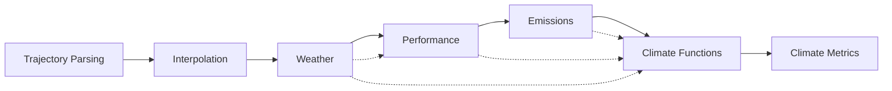

# General Presentation of PyNeats

PyNeats implements the computation pipeline defined in the *“Reference set of technical specifications for the MRV”* document (ref **EC-CLIMA/2024/NP/0014**).
Below, we outline the modules that fulfil these requirements and highlight the practical implementation choices made where the document provided no specific guidance.

---

## Architecture Overview

The architecture organises functionality into isolated Python packages, each dedicated to a single task.
This modular design facilitates easy comparison of alternative implementations in the future (e.g., different trajectory interpolators; NWP vs. reanalysis data; BADA vs. Poll–Schumann performance models; emissions via DLR, PyContrails, or EUROCONTROL).

From a computational standpoint, PyNeats relies on external Python libraries to compute the required climate metrics:

- **pyBADA** – performance computation
- **pyContrails** – CoCiP computation (contrails modelling in method C) and encapsulation of aCCFs
- **CLIMaCCF** – computation for other non-CO₂ species (method C)
- **OpenAirClim** – computation for small emitters (method D)

Because of its modular design, PyNeats does not always use the highest-level abstractions of its upstream libraries.
Nevertheless, it consistently builds on their established numerical utilities (primarily from PyContrails).
As a result, PyNeats introduces no new low-level numerical kernels.

---

## Modules

### 1. Trajectory Parsing
Retrieves the 4D trajectory and flight-level information from primary or secondary sources (e.g. OFP, QAR, ADS-B, or FTFM/RTFM/CTFM trajectories).

### 2. Interpolation / Resampling
Reconstructs the 4D trajectory to meet the **60-second sampling** requirement used by the CoCiP model for contrail-impact modelling.

### 3. Weather
Retrieves atmospheric data (currently from DWD’s ICON NWP model) and provides:
- Wind fields for the performance module.
- All atmospheric variables required by the climate functions.

### 4. Performance (currently using BADA)
- Computes fuel flow and mass when not provided in the primary data.
- Derives thrust and engine efficiency needed by CoCiP when not provided in the primary data.

### 5. Emissions
- Computes emission indices and numbers (vPM and nvPM).
- Supports relevant emissions models (BFFM2, T4/T2, …).
- Accounts for fuel properties.

### 6. Climate Functions
Translates emissions and performance outputs into climate forcing:
- **CoCiP** – contrails (Method C)
- **aCCFs** – other non-CO₂ species (Method C)
- **AirClim** – small emitters (Method D)

### 7. Climate Metrics
Converts climate-function outputs into requested metrics (e.g., GWP and CO₂-equivalent) using appropriate conversion factors.

---

## Module Dependencies

The computational logic is almost perfectly sequential and implemented as such in PyNeats.

---

## Design Choices

This section describes practical implementation and design decisions for each module and highlights (*in italics*) when choices were made beyond the technical requirements or standard PyContrails behaviour.
Most changes have been validated by the consortium.

---

### Trajectories

#### Secondary Data Sources
Two trajectory types are used as secondary data sources — **FTFM/RTFM** and **CTFM**:

#### FTFM / RTFM (4D)
- Produced by applying a 4D trajectory predictor (BADA-based) to the filed flight plan.
- RTFM is computed in case of regulations.
- Designed primarily for capacity management → not optimised for performance modelling.
- Coarse sampling (~1 point every 5 min), which may cause interpolation/performance issues.

#### CTFM (4D)
- Obtained by reconciling the original FTFM/RTFM with post-flight surveillance (ADS-B, radar).
- Adjustments applied when predefined thresholds are exceeded.
- Typically closer to reality than FTFM/RTFM but less accurate than direct ADS-B.
- Sampling is denser but still coarse.

---

### Preprocessing / Interpolation / Reconstruction

The interpolation module converts input trajectories (primary or secondary) to the **60-second** sampling cadence required by CoCiP.

- PyNeats currently uses **linear interpolation** via PyContrails' `resample_and_fill` method.
- For secondary data, coarse native sampling can yield segments that stray outside the flight envelope after interpolation.
- To obtain more realistic trajectories, **smoothing is applied to ground speed** using the **Savitzky-Golay filter** from PyContrails, reducing the number of segments that fall outside the flight envelope.
- For optional primary variables along the trajectory (e.g. true airspeed, aircraft mass, fuel flow, or engine efficiency), **linear interpolation** is applied to align their values with the trajectory timestamps. Missing data points are filled using the same method.

---

### DWD ICON Mapping with PyContrails Weather Variables

#### Required Map (CoCiP)
| DWD Variable | PyContrails Object |
|---------------|-------------------|
| `u` | EastwardWind |
| `v` | NorthwardWind |
| `omega` | VerticalVelocity |
| `temp` | AirTemperature |
| `qv` | SpecificHumidity |
| `qi` | MassFractionOfCloudIceInAir |

#### Optional Map (CoCiP)
| DWD Variable | PyContrails Object |
|---------------|-------------------|
| `geopot` | Geopotential |
| `clc` | CloudAreaFractionInAtmosphereLayer |
| `rhi` | RelativeHumidity |
| `pv` | PotentialVorticity |

#### Radiation Map
| DWD Variable | PyContrails Object |
|---------------|-------------------|
| `tsr` | TOANetDownwardShortwaveFlux |
| `olr` | TOAOutgoingLongwaveFlux |
| `sdr` | SurfaceSolarDownwardRadiation |

**Notes:**
- `clc` is divided by 100 (PyContrails expects values ∈ [0, 1]).
- Relative humidity units are adjusted to PyContrails conventions.
- PyContrails expects **surface** solar downward radiation (SSDR) as input for aCCF, though the model uses TOA values.
  - This is acceptable because SSDR is used only to determine day/night parameterisation.
  - The actual CH₄ parameterisation uses internally calculated TOA radiation (as in CoCiP).

---

### Weather Intersection with Flight

Performance models such as BADA require **true airspeed (TAS)** to simulate flight dynamics.
TAS is derived from wind, ground speed, heading, and track.

To support this:
- DWD provides an **additional wind-field dataset (840–570 hPa, FL050–FL150)** to complement the main file (550–140 hPa, FL160–FL460).
- Both wind datasets are **concatenated**. Below FL050 (840 hPa), wind is set to zero, simplifying TAS derivation in the lower atmosphere.
- **Temperature**: interpolated on the main file (550–140 hPa) to provide BADA with the required correction relative to the standard atmosphere. Extrapolation for lower altitudes is performed in the performance module.
- **Specific humidity**: interpolated on the main file (550–140 hPa) to supply the emission model for further use in CoCiP.
- Weather is sub-sampled using PyContrails' `downselect_met()` before `intersect_met()` for efficiency.

---

### Performance Model

PyNeats currently uses **BADA** (via pyBADA) for performance computations.

#### Basic Parameterisation
- Wind fields above 840 hPa used to compute TAS; below → set to 0.
- Temperature correction relative to standard atmosphere above 550 hPa.
- BADA phases inferred from vertical speed thresholds.

#### Input Decision Logic

The emissions and climate modules require **fuel flow** and **engine efficiency** at each trajectory point. PyNeats follows this decision tree:

1. **Fuel flow and engine efficiency provided** → use directly; skip performance step.
2. **Only fuel flow provided** → use AO fuel flow for downstream calculations, but compute engine efficiency via BADA thrust and fuel flow. *Note*: BADA fuel flow must still be computed at each point to derive engine efficiency correctly.
3. **Aircraft mass evolution provided** → use directly in BADA to compute fuel flow, thrust, and engine efficiency.
4. **Only take-off weight (TOW) provided** → use TOW within the performance model to estimate mass evolution, then compute fuel flow, thrust, and engine efficiency.
5. **No mass nor TOW provided** → infer mass from load factor (AO-provided or conservative default of 1):

\[
m_{\text{init}} = OEW + \text{load\_factor} \times (MTOW - OEW)
\]

Then iterate:
1. Compute fuel flow and fuel burn at each trajectory point
2. Estimate fuel reserve (≈ 3 % of trip fuel)
3. Update TOW:

\[
TOW = \min(MTOW,\ OEW + \text{load\_factor} \times MPL + \text{consumed\_fuel} + \text{reserve})
\]

4. Reduce aircraft mass along trajectory according to fuel burnt
5. Iterate until convergence (Δmass < tol %).

!!! note
    In PyNeats, steps 1–4 are performed **twice** to balance accuracy and computational cost. Note that BADA 3 does not provide MPL; in that case MPL = MTOW − OEW.

See [Input Prioritization](input_prioritization.md) for the full decision flowchart.

#### Additional Parameters
- Fuel calorific value (`q_fuel`) from AO, if provided, linearly corrects `fuel_flow_rate`.
- ICAO↔BADA type mapping from EUROCONTROL: the correspondence between ICAO aircraft types, aircraft versions, engine identifiers and BADA types (BADA 4 in priority, then BADA 3) follows a multi-level fallback chain. The engine UID for emission computations uses the MRR conservative value if not provided as primary data.

---

### Emission Model

PyNeats uses PyContrails' emission utilities (BFFM2 for gaseous emissions, T4/T2 for nvPM).
To account for fuel properties provided by AOs, a **custom `NEATSFuel` class** (inheriting from `SAFBlend`) is used:

- All fuel properties from `SAFBlend` are initially set to their defaults.
- **Hydrogen content**: if provided by the AO, overrides the default. Otherwise, if the H/C ratio (*r*) is provided:

\[
H = \frac{r \times 1.008}{12.011 + r \times 1.008}
\]

- If neither hydrogen content nor H/C ratio is provided, the default (13.8 %, JET-A from PyContrails) is used.
- **Water emission index** (`ei_h2o`): the default of 1.23 is adjusted linearly based on hydrogen content, consistent with the `SAFBlend` class.
- **nvPM**: reduced using PyContrails' `black_carbon` class, parameterised by hydrogen content (currently only available for SAF blends in PyContrails).
- **Calorific content** (`q_fuel`): if provided by the AO, overrides the default, influencing nvPM and T4/T2.
- Aromatic content, sulphur, and naphthalene fuel properties (which an AO can provide) are **not yet used** by any calculation.
- Emission computations enforce ICAO engine identifiers.

!!! info "For the 2025 report"
    It is unlikely that AOs will produce primary fuel properties. These may be replaced by statistics from the **RefuelEU** project (aggregated by airport).

---

### Climate Functions

The parameterisation of climate functions follows the technical requirements.

- Any change in **`q_fuel`** impacts **SAC** (Schmidt-Appleman Criterion) computation within CoCiP.
- It has been decided (in coordination with the consortium) to **not use any humidity correction** in the current implementation.

---

### Climate Metrics

#### Contrails

\[
AGWP_{Con}(H) = \frac{EF \cdot (ERF/RF)_{Con}}{S_{Earth}} \quad [J \cdot m^{-2}]
\]

- \( EF \): total contrail energy forcing from CoCiP [J]
- \( (ERF/RF) = 0.37 \): efficacy (from technical spec)
- \( S_{Earth} = 5.101\times10^{14}\,m^2 \)

#### CO₂

\[
AGWP_{CO2}(H) = C(H) \cdot m_{CO2} \cdot s_{yr}
\]

where
\( s_{yr} = 31\,556\,952 \) s / yr
and \( C(H) \) (Joos 2013):

| Horizon (y) | C(H) [×10⁻¹⁵ W m⁻² yr kg⁻¹] |
|--------------|-------------------------------|
| 20 | 25.2 |
| 50 | 53.5 |
| 100 | 92.5 |

#### CO₂-Equivalent for Contrails

\[
CO2_{eq,Con}(H) = \frac{EF \cdot (ERF/RF)_{Con}}{S_{Earth} \cdot C(H) \cdot s_{yr}} \quad [kg]
\]

#### Other Species (via aCCFs and Dahlmann 2025)

\[
AGWP_{Spec}(H) =
\frac{K_{AGWP←RF}^{Spec}(H)}{K_{ATR←RF}^{Spec}(H)}
\cdot EF(ERF/RF)_{Spec}
\cdot \frac{C_{ATR←Pulse}^{Spec}(H)}{C_{ATR←Pulse}^{Spec}(H_0)}
\cdot ATR^{Spec}(H_0)
\]

where:
- \( K_{AGWP←RF}^{Spec}(H) \): conversion factor from RF to AGWP (Dahlmann 2025)
- \( K_{ATR←RF}^{Spec}(H) \): conversion factor from RF to ATR (Dahlmann 2025)
- \( C_{ATR←Pulse}^{Spec}(H) \): conversion from pulse emissions in *climaccf* (Yin et al. 2023, Dietmüller et al. 2023)
- \( ATR^{Spec}(H_0) \): output from CLIMaCCF with pulse scenario and no efficacy parameterisation
- \( H_0 = 20\,y \): reference horizon for pulse computation within CLIMaCCF
- \( EF(ERF/RF)_{Spec} \): efficacy from spec document

!!! note
    The RF backward calculation factor \( C_{ATR←Pulse}^{Spec}(H) \) from CLIMaCCF v1.0/v1.0a must be **discounted** in the denominator because it is not consistent with the Dahlmann 2025 conversion factors.

Then,

\[
CO2_{eq,Spec}(H) = \frac{AGWP_{Spec}(H)}{C(H) \cdot s_{yr}} \quad [kg]
\]

---

*(End of Document)*
